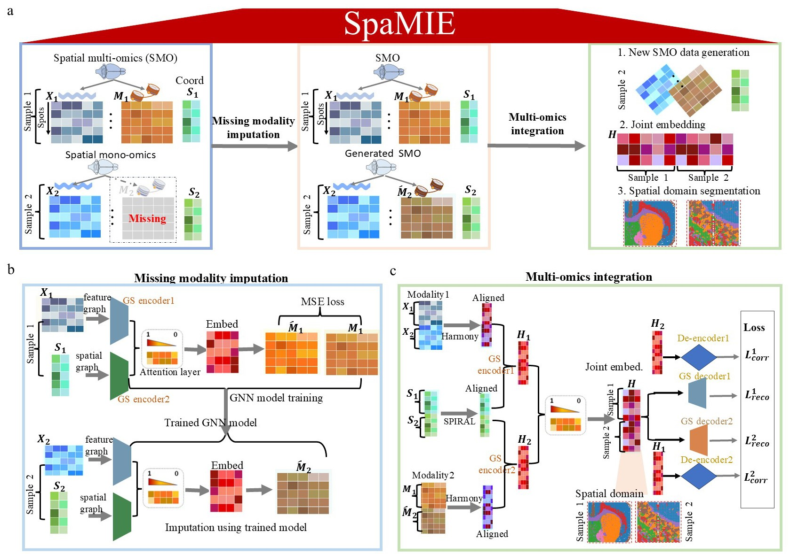

.. SpaMIE documentation master file, created by
   sphinx-quickstart on Sat Oct  4 17:26:00 2025.
   You can adapt this file completely to your liking, but it should at least
   contain the root `toctree` directive.

Welcome to SpaMIE's documentation!
====================

Spatial Multi-Omics Imputation and Embedding with SpaMIE
=====================================================================================================================================================

.. toctree::
   :maxdepth: 2
   :caption: Contents:

   Installation
   Tutorial 1_data inputation and integration for simulation

